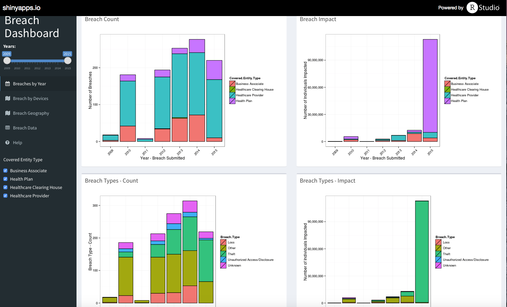
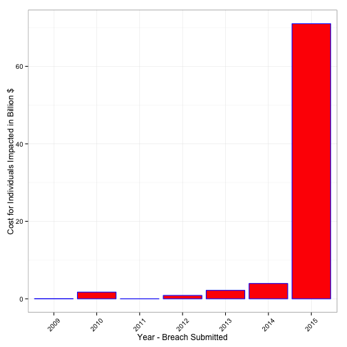
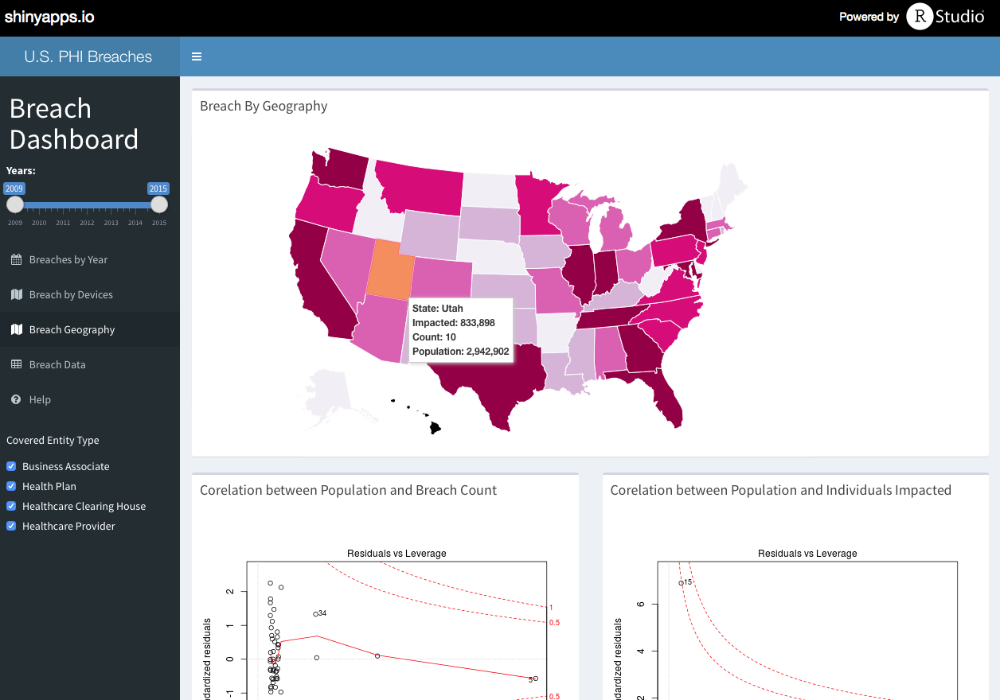

United States PHI-Breach-Dashboard
========================================================
author: Brett Taylor
date: November 22, 2015
xxx: "We Resolve Breaches"

Overview
========================================================
 - What is considered a Healthcare Breach in the U.S.?
 - Why is this important?
 - How should you choose the right areas of focus?
 
What is a Health Breach in the United States?
==============
A Healthcare Breach is defined by the HiTech act of 2009.  The definition is:

Breach. means the acquisition, access, use, or disclosure of protected health information in a manner not permitted under subpart E of this part which compromises the security or privacy of the protected health information (PHI).

Breaches must be reported to the Department of Health and Human Services when over 500 individuals protected information is revealed.

Why is this important?
========================================================

- Over that last 6 years, more than 1,000 breaches have been identified in the United States Healthcare Market, and a study by Poneomon, Inc. identifed the cost / record is $363 in Healthcare.
 

Choose the Right Area to Focus
========================================================
- Review the data associated with breaches provided by the U.S. Health and Human Services website which is updated periodicaly. 
- Data Analytics will allow you to choose the true risks vs. what our guts tell us.
- Utilize the Breach Dashboard which displays a breakdown of the breach records over the last 6 years.

 
One more piece of information
===================================
- The top source of breaches in the United States are when a device is lost or stolen and it is not encrypted.
- Cyber threats increase, and yet the majority of breaches are still require basic protection.
- To understand the source of breaches, please take a look at the Breach Dashboard.
[Breach Dashboard](https://hitfuturenow.shinyapps.io/PHIBreachDashboard)
